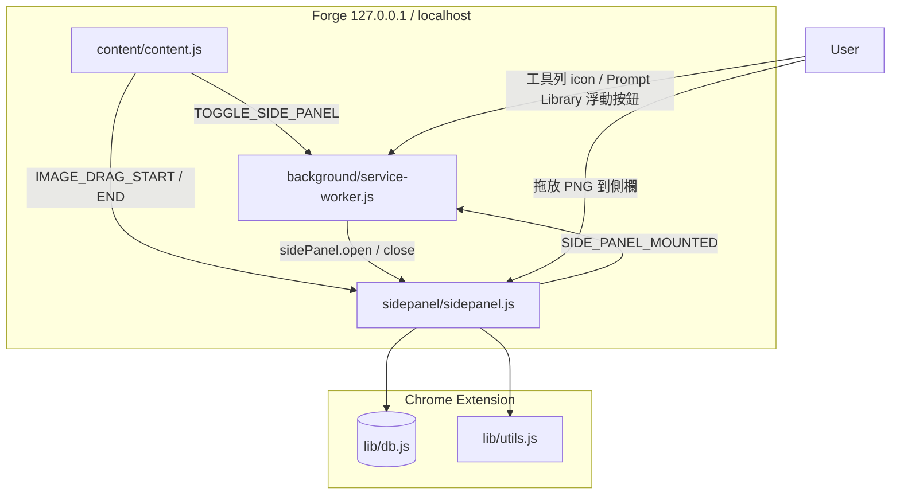

# Forge Prompt Library

Chrome **Manifest V3** 擴充功能，搭配 **Stable Diffusion WebUI Forge** 使用。在 Forge 生圖頁面開啟側欄（Side Panel），依正負提示詞組合管理生成圖片。

> **給 AI 的說明**：UI 文案為英文；所有使用者資料存於本機 IndexedDB，不上傳伺服器（副標：`All data is stored locally on your device.`）。主要邏輯在 `sidepanel/sidepanel.js`（~1340 行），儲存層在 `lib/db.js`，PNG 解析在 `lib/utils.js`，Side panel 開關在 `background/service-worker.js`。

---

## 專案概述

| 項目 | 說明 |
|------|------|
| 名稱 | Forge Prompt Library |
| 平台 | Chrome Extension MV3 |
| 目標使用者 | 使用 Forge 生圖、需要依提示詞組合整理歷史圖片的人 |
| 核心價值 | 拖 Forge PNG → 依「正+負提示詞」自動歸類、本機持久化、匯出匯入 |
| 授權 | [MIT License](LICENSE)，開源 |
| 作者 | [lovebuizel](https://github.com/lovebuizel) |

---

## 架構



### 各層職責

| 檔案 | 職責 |
|------|------|
| `manifest.json` | MV3、sidePanel、content_scripts、權限 |
| `background/service-worker.js` | Side panel toggle、`sidePanelOpenByWindow` Map、tab 綁定 |
| `content/content.js` | Forge 右下角 **Prompt Library** 按鈕；圖片 drag 廣播 |
| `sidepanel/sidepanel.html` | Header + `#prompt-list` |
| `sidepanel/sidepanel.css` | 深色主題、正/負色塊、輪播、viewer |
| `sidepanel/sidepanel.js` | 列表、輪播、viewer、拖放 ingest、Storage、匯出匯入 |
| `lib/db.js` | IndexedDB CRUD、匯出匯入、`estimateStorageUsage` |
| `lib/utils.js` | PNG 解析、`promptToTags`、原圖 data URL |

### Side Panel 開關

| 事件 | 行為 |
|------|------|
| `TOGGLE_SIDE_PANEL` | 依 `windowId` Map → `close` 或 `open`（優先 `tabId`） |
| `chrome.sidePanel.onClosed` | Map 設 `false` |
| `SIDE_PANEL_MOUNTED` | Map 設 `true` |
| 無 `sidePanel.close` | `REQUEST_SIDE_PANEL_CLOSE` → `window.close()` |

不要用 `chrome.runtime.getContexts` 判斷開關。`close()` 需 Chrome 141+。

### 跨元件訊息

| type | 方向 | 用途 |
|------|------|------|
| `TOGGLE_SIDE_PANEL` | content → background | 切換 side panel |
| `SIDE_PANEL_MOUNTED` | sidepanel → background | 同步開啟狀態 |
| `REQUEST_SIDE_PANEL_CLOSE` | background → sidepanel | 舊版 Chrome fallback |
| `IMAGE_DRAG_START` / `END` | content → sidepanel | 拖放高亮（側欄須已開啟） |

---

## UI 布局

```
body (flex column, min-height 100dvh)
├── .app-header-wrap (sticky)
│   ├── #storage-usage
│   └── .app-header
│       ├── 標題 + 副標
│       └── Export | Import | Delete All Data
└── main#prompt-list.prompt-list (flex:1)
    └── .prompt-item × N
```

- 單欄全寬；`#prompt-list` 撐滿 header 以下空間
- Header 按鈕靠右（`.header-actions`）
- 正/負提示詞：`.prompt-field-positive`（綠）、`.prompt-field-negative`（紅）
- 輪播縮圖：`--carousel-item-size: 120px`

---

## 目錄結構

```
prompt-manage-extension/
├── manifest.json
├── background/service-worker.js
├── content/content.js
├── lib/db.js
├── lib/utils.js
├── sidepanel/
│   ├── sidepanel.html
│   ├── sidepanel.css
│   └── sidepanel.js
├── icons/
├── LICENSE
└── README.md
```

---

## 資料模型（IndexedDB）

- **資料庫**：`forgePromptManager`
- **版本**：`2`
- **本機儲存**，無遠端 API

### `prompts`

```js
{
  id: string,
  key: string,              // makePromptKey(positive, negative)
  positive: string,
  negative: string,
  note: string,
  createdAt: number,
  updatedAt: number,
  images: [{
    id, fileName, thumbnailId, addedAt,
    metadata: { steps, sampler, seed, size, model, ... }
  }]
}
```

### `thumbnails`

Store 名稱為 `thumbnails`，存放**原圖 PNG data URL**：

```js
{ imageId: string, dataUrl: string }
```

寫入：`createImageDataUrl(file)` → `saveThumbnail(id, dataUrl)`

### 分組

```js
makePromptKey(positive, negative) => `${positive}\u0000${negative}`
```

相同正+負提示詞歸同一筆；不同 seed 仍同組。

### 匯出格式（version 2）

```js
{
  version: 2,
  exportedAt: ISO string,
  prompts: PromptRecord[],
  thumbnails: { [thumbnailId]: dataUrl }
}
```

### Storage 用量

Header `#storage-usage` 顯示 `prompts` + `thumbnails` 估算容量；tooltip 細分 Images / Prompts。

---

## 功能

### 提示詞列表

每筆 `.prompt-item` 含：

| 區塊 | 說明 |
|------|------|
| Header | ID 前 8 字 + 建立時間 + Delete Prompt |
| Note | textarea，blur 儲存 |
| Positive / Negative | 色塊、可點擊複製的 tag、Copy 按鈕 |
| Carousel | 120px 縮圖、scrollbar、箭頭、zoom / delete |
| Metadata | Steps、Sampler、Seed 等 |

**新增方式**：拖 Forge 生成的 PNG 到側欄任意位置。

```
resolveDroppedImageFiles
  → ingestImageFile → parseImageFile
  → createImageDataUrl → saveThumbnail
  → addImageToPromptByPair → loadPrompts → focusPromptItem
```

### 拖放

| 步驟 | 說明 |
|------|------|
| Forge dragstart | content 送 `IMAGE_DRAG_START`，側欄高亮 |
| dragover | `document` + `#prompt-list`（capture）；`preventDefault` |
| 有效拖放 | `forgeImageDragActive` 或 `Files` 或 `text/uri-list` / `text/html` |
| 取得檔案 | 優先 `dataTransfer.files`；否則 URL → `fetch` → `File` |
| 排除區 | dialog、Import label 不觸發 ingest |

Forge 拖曳常帶 URL 而非 `Files`，需支援 URL fetch。

### 輪播

- 縮圖不可 HTML drag；carousel 以 pointer 橫向 pan
- Hover：放大、刪除；雙擊開 viewer
- 無預覽：🥟 placeholder

### 全圖查看器（`#image-viewer`）

- 黑色全屏；預設寬度撐滿側欄（`fitScale`）
- 滾輪以滑鼠為中心縮放 1×～8×；縮回 1×不重置位置
- `clampViewerPan` 邊界限制；`ResizeObserver` 隨側欄 relayout
- 開啟時 `body.viewer-open`，輪播不搶 pointer

`viewerState`：`naturalWidth/Height`, `fitScale`, `zoom`, `x`, `y`

### Header

| 按鈕 | 行為 |
|------|------|
| Export | 下載 `forge-prompt-library-YYYY-MM-DD.json` |
| Import | JSON → `importAllData` |
| Delete All Data | 確認後 `clearAllData()` |

刪除相關操作使用 `requestConfirm` 單次確認。

---

## PNG Metadata

| 來源 | 自動歸類 |
|------|----------|
| Forge / A1111 `parameters` | ✅ |
| ComfyUI 原生 JSON | ❌ |
| ComfyUI + 額外 `parameters` | ⚠️ 視設定 |

`lib/utils.js`：`extractPngTextChunks` → `parseParametersString`

---

## 程式參考

### sidepanel.js `state`

```js
{
  prompts,
  selectedImageByPrompt: { [promptId]: imageId },
  pendingPromptFocus: { promptId, imageId },
  confirmAction,
}
```

| 領域 | 函式 |
|------|------|
| 列表 | `loadPrompts`, `renderPromptList`, `createPromptItemElement`, `renderPromptTagList` |
| 拖放 | `setupGlobalDropZone`, `resolveDroppedImageFiles`, `extractDraggedImageUrl` |
| Ingest | `ingestImageFile` |
| 輪播 | `setupCarouselNav`, `setupCarouselPan`, `updateCarouselUI` |
| Viewer | `openImageViewer`, `layoutViewerImage`, `applyViewerZoomAtPoint`, `clampViewerPan` |
| Storage | `updateStorageUsage`, `scheduleStorageUsageUpdate` |
| 確認 | `requestConfirm` |

### lib/utils.js

| 函式 | 用途 |
|------|------|
| `extractPngTextChunks` | 讀 PNG tEXt |
| `parseParametersString` | 解析 parameters |
| `parseImageFile` | File → 提示詞 + metadata |
| `promptToTags` | 提示詞拆 tag（列表顯示） |
| `createImageDataUrl` | 原圖 data URL |

### lib/db.js

| 函式 | 用途 |
|------|------|
| `getAllPrompts` / `savePrompt` / `deletePrompt` | 提示詞 CRUD |
| `saveThumbnail` / `getThumbnail` / `deleteThumbnail` | 圖片 data |
| `exportAllData` / `importAllData` | 匯出匯入 |
| `clearAllData` | 清空全部 |
| `estimateStorageUsage` | 容量估算 |

---

## 開發與測試

1. `chrome://extensions/` → 開發人員模式 → 載入未封裝項目
2. 開 Forge → **Prompt Library** 或工具列 icon 開關側欄
3. 拖 PNG 到列表區 → 自動歸類
4. 改程式後：重載擴充功能 + F5 刷新 Forge

Content script 僅匹配 `127.0.0.1` / `localhost`；其他 host 需改 `manifest.json` 與 `background/service-worker.js`。

慣例：ES modules、vanilla JS、日期 locale `en-US`。

---

## 已知限制

| 項目 | 說明 |
|------|------|
| 儲存 | 原圖 data URL 占用大，留意 Storage 指示 |
| Forge host | 預設本機 |
| PNG | 僅 A1111/Forge `parameters` 格式 |
| Side panel | `close()` 需 Chrome 141+ |
| 商店 | `host_permissions` 含 `http://*/*` 可能需審核說明 |

---

## 快速決策表（給 AI）

| 想改… | 先看… |
|--------|--------|
| 文案 / Header | `sidepanel.html` |
| 布局 / 色塊 / 輪播 | `sidepanel.css` |
| 列表 / 輪播 / 確認框 | `sidepanel.js` |
| 拖放 / URL fetch | `setupGlobalDropZone`, `resolveDroppedImageFiles` |
| Viewer | `openImageViewer`～`setupImageViewerControls` |
| Storage | `updateStorageUsage`, `estimateStorageUsage` |
| 資料 / 匯出 | `lib/db.js` |
| PNG | `lib/utils.js` |
| Forge 浮動鈕 | `content/content.js` |
| Side panel toggle | `background/service-worker.js` |
| 權限 / URL | `manifest.json` |

---

## 作者與授權

本專案以 [MIT License](LICENSE) 開源。

| | |
|---|---|
| 作者 | [lovebuizel](https://github.com/lovebuizel) |
| GitHub | https://github.com/lovebuizel |
| 網站 | https://www.lovebuizel.com/ |
